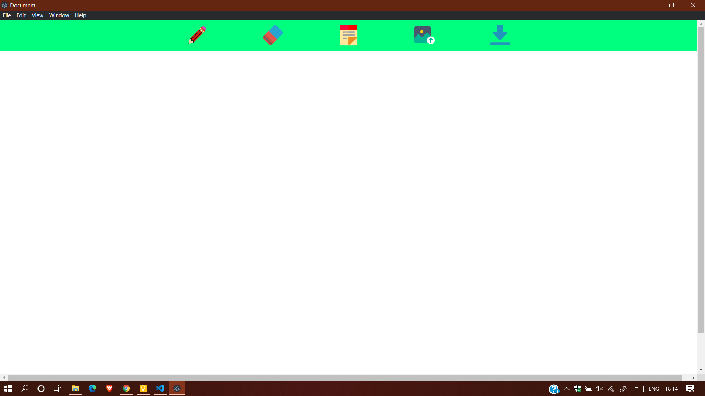
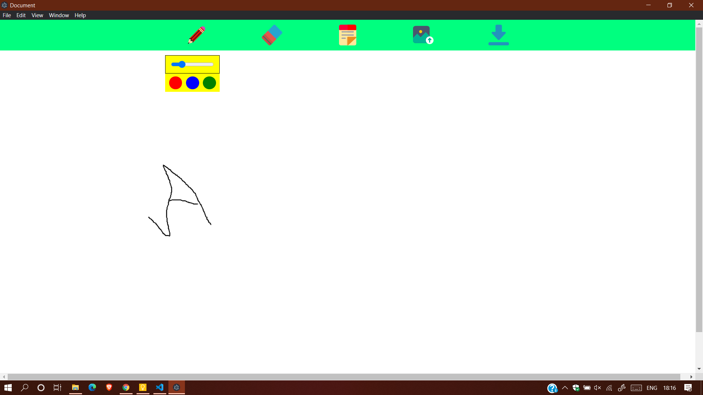
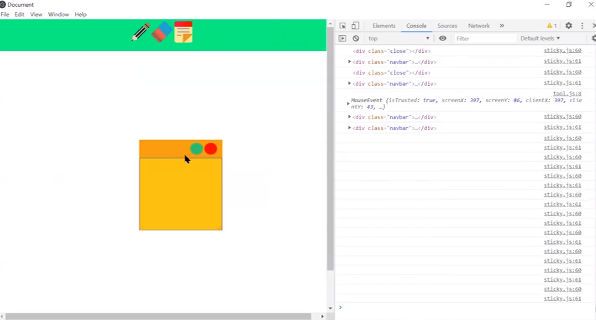

# WhiteBoard
A canvas electron application to draw shapes,text and post images.

# Prerequisites

Install puppeteer `npm install electron`

# Features
  - Draw shapes
  - Free hand writing
  - Undo Redo
  - Eraser
  - StickyPad
  - Upload file 
  - Download canvas
   
 # Dependencies : 
 1. CanvasRenderingContext2D API  
    
 2. Konva Library
   
# Screenshots :

Blank Page : 

Freehand: 

StickyPad: 

